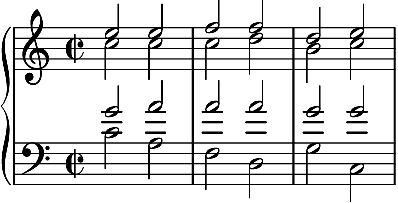
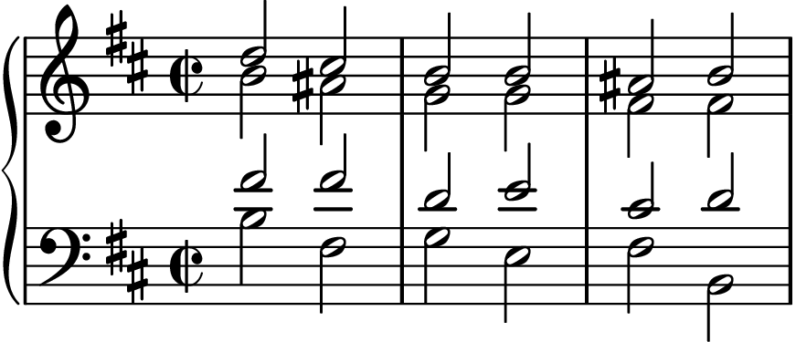
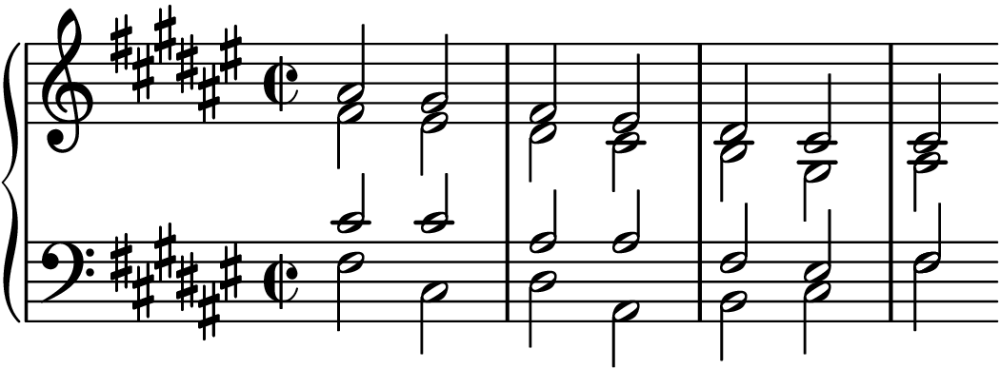
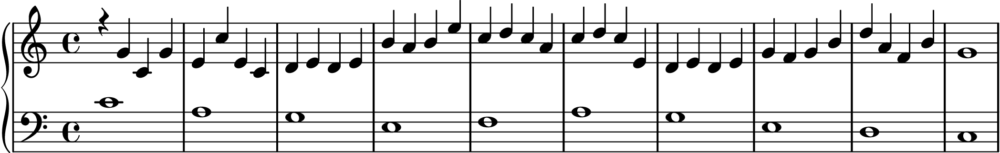
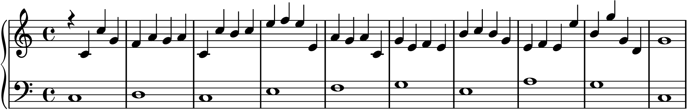

# ai_wasei3

バスと調を与えると和声とか対位法を実施してくれるやつです。

楽譜の描画には別途lilypondをインストールしてください。

## 和声の実行例

### 1

```
uv run python -m my_project.main --bass C4 A3 F3 D3 G3 C3 --tonic C --mode MAJOR > dist/out.ly
lilypond --png -dcrop -dno-print-pages -dresolution=300 -o dist/out.png dist/out.ly
open dist/out.png.cropped.png
```



### 2

```
uv run python -m my_project.main --bass B3 F#3 G3 E3 F#3 B2 --tonic B --mode MINOR > dist/out.ly
lilypond --png -dcrop -dno-print-pages -dresolution=300 -o dist/out.png dist/out.ly
open dist/out.png.cropped.png
```



V から VI の進行で導音を上行させる規則に対応できていません

### 3

```
uv run python -m my_project.main --bass F#3 C#3 D#3 A#2 B2 C#3 F#3 --tonic F# --mode MAJOR > dist/out.ly
lilypond --png -dcrop -dno-print-pages -dresolution=300 -o dist/out.png dist/out.ly
open dist/out.png.cropped.png
```




## 対位法の実行例

実行のたびに結果が変わります。連続のチェック入ってます。細かめのルールがまだいくつか実装されていません。

### 1

```
uv run python -m my_project.counterpoint.main --cf C4 A3 G3 E3 F3 A3 G3 E3 D3 C3 > dist/out.ly
lilypond --png -dcrop -dno-print-pages -dresolution=300 -o dist/out.png dist/out.ly
open dist/out.png.cropped.png
```



### 2

`--rythmn` には `half`, `quater` が利用できます

```
uv run python -m my_project.counterpoint.main --cf C3 E3 D3 G3 A3 G3 E3 F3 D3 C3 --rythmn half > dist/out.ly
lilypond --png -dcrop -dno-print-pages -dresolution=300 -o dist/out.png dist/out.ly
open dist/out.png.cropped.png
```




## よく使うコマンド

```
uv run python -m my_project.main

uv pip install -e ".[dev]"

uv run pytest
uv run ruff format .
uv run mypy src

uv run python -m cProfile -m my_project.counterpoint.main --cf C4 A3 G3 E3 F3 A3 G3 E3 D3 C3

uv run python -m cProfile -o profile.stats -m my_project.counterpoint.main --cf C4 A3 G3 E3 F3 A3 G3 E3 D3 C3
uv run snakeviz profile.stats
```

