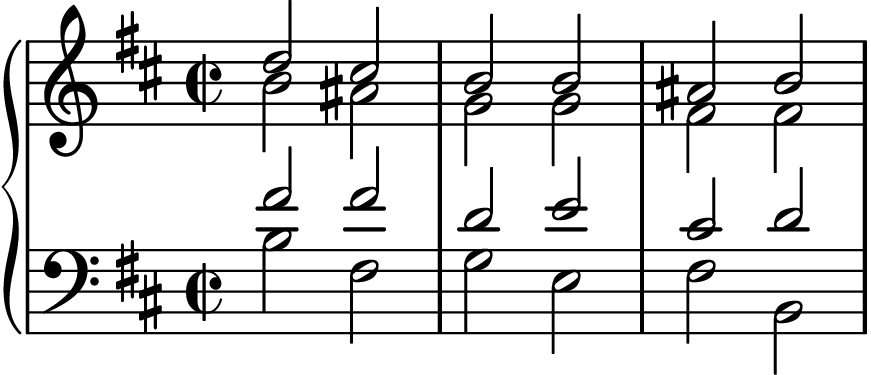
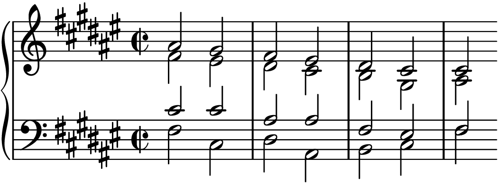
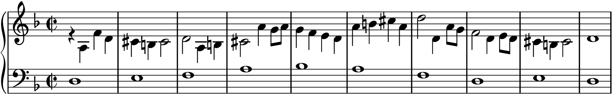

# ai_wasei3

バスと調を与えると和声とか対位法を実施してくれるやつです。

楽譜の描画には別途lilypondをインストールしてください。

## 和声の実行例

### 1

```
uv run python -m my_project.main --bass C4 A3 F3 D3 G3 C3 --tonic C --mode MAJOR > dist/out.ly
lilypond --png -dcrop -dno-print-pages -dresolution=300 -o dist/out.png dist/out.ly
open dist/out.png.cropped.png
```


### 2

```
uv run python -m my_project.main --bass B3 F#3 G3 E3 F#3 B2 --tonic B --mode MINOR > dist/out.ly
lilypond --png -dcrop -dno-print-pages -dresolution=300 -o dist/out.png dist/out.ly
open dist/out.png.cropped.png
```



V から VI の進行で導音を上行させる規則に対応できていません

### 3

```
uv run python -m my_project.main --bass F#3 C#3 D#3 A#2 B2 C#3 F#3 --tonic F# --mode MAJOR > dist/out.ly
lilypond --png -dcrop -dno-print-pages -dresolution=300 -o dist/out.png dist/out.ly
open dist/out.png.cropped.png
```




## 対位法の実行例

実行のたびに結果が変わります。連続のチェックちょっと一旦ないです。細かめのルールがまだいくつか実装されていません。



### 通常実行モード

`main.py` を実行すると、デフォルトで対位法の結果がシンプルなテキスト形式でコンソールに出力されます。`--output` オプションで出力形式を、`--limit` オプションで出力数を制御できます。

```bash
# デフォルト (simple形式で1つだけ出力)
uv run python -m my_project.counterpoint.main \
  --cf C4 A3 G3 E3 F3 A3 G3 E3 D3 C3 \
  --species fifth \
  --limit 1 \
  --part_id SOPRANO

# simple形式で3つ出力。途中出力のデバッグあり
uv run python -m my_project.counterpoint.main \
  --cf C4 A3 G3 E3 F3 A3 G3 E3 D3 C3 \
  --species fifth \
  --output simple \
  --limit 3 \
  --log-level DEBUG

# lilypond形式で1つ出力
uv run python -m my_project.counterpoint.main \
  --cf C4 A3 G3 E3 F3 A3 G3 E3 D3 C3 \
  --species fifth \
  --output lilypond \
  --limit 1
```

### lilypond経由でpngファイルを出力する

`main.py` の `--generate-pngs` オプションを使用することで、指定した数の対位法を生成し、LilyPond経由でPNGファイルとして出力できます。

```bash
# 10枚のPNG画像を生成し、dist/ ディレクトリに保存 (実行前に既存ファイルを削除)
uv run python -m my_project.counterpoint.main \
  --cf C4 A3 G3 E3 F3 A3 G3 E3 D3 C3 \
  --species fifth \
  --generate-pngs 10 \
  --output-dir dist \
  --clean

# 生成された .ly ファイルを残しつつ、5枚のPNG画像を custom_output/ ディレクトリに保存
uv run python -m my_project.counterpoint.main \
  --cf C4 A3 G3 E3 F3 A3 G3 E3 D3 C3 \
  --species fifth \
  --generate-pngs 5 \
  --output-dir custom_output \
  --keep-ly
```

**注意点:**
*   `lilypond` コマンドがシステムパスに設定されている必要があります。
*   `--output-dir` で指定したディレクトリが存在しない場合、自動的に作成されます。
*   `--clean` オプションを使用すると、指定ディレクトリ内の既存の `.png` および `.ly` ファイルが削除されます。
*   `--keep-ly` オプションを使用しない場合、中間生成物である `.ly` ファイルは削除されます。

## コマンドラインオプション一覧

### 一般的なオプション
- **`--cf <NOTE>...`** (必須): スペース区切りで定旋律 (Cantus Firmus) の音符を指定します (例: `C4 A3 G3`)。
- **`--species <TYPE>`**: 対位法の種別を指定します。
  - 選択肢: `first`, `second`, `third`, `fourth`, `fifth`
  - デフォルト: `third`
- **`--key <KEY>`**: 対位法生成の調を指定します (例: `C Major`, `A Minor`)。
  - デフォルト: `C Major`
- **`--part_id <ID>`**: 生成する対位旋律のパートIDを指定します。
  - 選択肢: `SOPRANO`, `ALTO`, `TENOR`, `BASS`
  - デフォルト: `SOPRANO`

### デバッグ用オプション

- **`--seed <INTEGER>`**: 乱数シードを整数で指定し、結果を再現可能にします。
- **`--log-level <TYPE>`**: ログレベル。 `DEBUG` を指定すると生成の途中経過が表示されます。
  - 選択肢: `DEBUG`, `INFO`, `WARNING`, `ERROR`, `CRITICAL`
  - デフォルト: `INFO`

### コンソール出力モードのオプション
- **`--output <FORMAT>`**: コンソールへの出力形式を指定します。
  - 選択肢: `simple`, `lilypond`
  - デフォルト: `simple`
- **`--limit <NUMBER|infinity>`**: 出力する解の最大数を指定します。
  - デフォルト: `infinity`

### PNG生成モードのオプション
- **`--generate-pngs <INTEGER>`**: 生成するPNG画像の枚数を指定します。このオプションを指定するとPNG生成モードが有効になります。
- **`--output-dir <PATH>`**: 生成ファイル (PNG, .ly) の出力先ディレクトリを指定します。
  - デフォルト: `dist`
- **`--clean`**: PNG生成前に出力ディレクトリ内の既存の `.png` と `.ly` ファイルを削除します。
- **`--keep-ly`**: PNG生成後、中間生成物である `.ly` ファイルを削除せずに残します。

---


## よく使うコマンド

```
uv run python -m my_project.main

# -e つけないとだめだよ
uv pip install -e .
uv pip install -e ".[dev]"

uv run pytest
uv run ruff format .
uv run mypy src

uv run python -m cProfile -m my_project.counterpoint.main --cf C4 A3 G3 E3 F3 A3 G3 E3 D3 C3
uv run python -m cProfile -o profile.stats -m my_project.counterpoint.main --cf C4 A3 G3 E3 F3 A3 G3 E3 D3 C3
uv run snakeviz profile.stats
```
