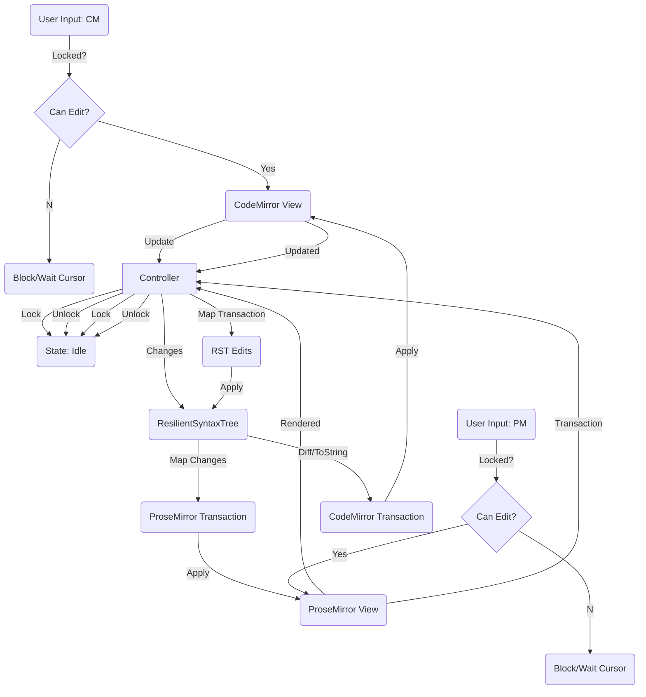

# アーキテクチャ設計

## EditorController & RST 統合

### コンポーネント相互作用図



### 1. 排他制御 (Locking Mechanism)

不整合を防ぐため、`EditorController` は状態マシンとして振る舞う。

- **States**:
  - `Idle`: どちらのエディタも操作可能。
  - `ProcessingFromCM`: CodeMirror からの変更を処理中。ProseMirror はロック（操作不可）。
  - `ProcessingFromPM`: ProseMirror からの変更を処理中。CodeMirror はロック（操作不可）。

- **UI Feedback**:
  - ロックされている側のエディタに対して、マウスカーソルを `wait` や `not-allowed` に変更する等のスタイル適用を行う（背景グレーアウトは行わない）。
  - `EditorView` の拡張機能（Extension/Plugin）として実装し、コントローラーの状態を監視させる。

### 2. マッピング戦略 (Mapping Strategy)

#### CM -> RST -> PM

- RST ノードは一意な `id` を持つ。
- ProseMirror ノードの `attrs` にこの `id` を保持させる。
- RST の変更箇所に対応する ID を特定し、ProseMirror ドキュメント内の該当ノードを検索して更新する。

#### PM -> RST -> CM (重要)

- **目標**: 全文置換ではなく、ProseMirror の `Transaction` (Steps) を解析し、RST への `edit` 操作（範囲と挿入文字列）に変換する。
- **アプローチ**:
  - ProseMirror の変更範囲（`from`, `to`）に対応するノード ID を特定。
  - RST 上でその ID を持つノードを検索。
  - ノード内の相対位置を計算し、RST の絶対位置へ変換。
  - **Fallback**: 複雑な構造変更（ノードのラップ解除やマージなど）でマッピングが困難な場合のみ、最小限の親ノードスコープでの再シリアライズを行うが、基本は座標変換を目指す。
  - **中断基準**: このマッピングロジックの実装において、RST の構造と ProseMirror のスキーマの乖離により、一貫性のある変換が定義できない場合、タスクを中断し設計変更案を作成する。

### 3. MEI 要素の表示

- **Schema Definition**:
  - ProseMirror スキーマにおいて、`<mei>` タグを `Atom` ノード（`isLeaf: true`）として定義するか、あるいは特別な `NodeView` を持つノードとして定義する。
- **Rendering**:
  - `<mei>` ノードの内容は、RST ノードの `toString()` 結果（生の XML 文字列）。
  - ProseMirror 上では、このノードは `<pre class="mei-content">XML_CONTENT</pre>` としてレンダリングされる。
  - CSS で `overflow: auto; max-height: ...;` を指定しスクロール可能にする。

### 4. デバッグログ

`EditorController` はリングバッファ形式で直近のイベントログを保持する。

```typescript
interface LogEntry {
  timestamp: number;
  source: "CM" | "PM";
  type: "Receive" | "Apply" | "Map";
  details: string; // 例: "Received change at 10: 'a'", "Mapped to RST node-123"
  relatedAction?: string; // 相手のエディタへのアクション
}
```

### 5. 将来の展望: Yjs (Proposal)

現在のロック方式は UX を損なう可能性がある。将来的には：

- RST を Yjs の `Y.XmlFragment` にバインディングする。
- CM と PM それぞれが Yjs binding を通じて状態を共有する。
- これにより、ロックなしでの同時編集と結果整合性が保証される。
